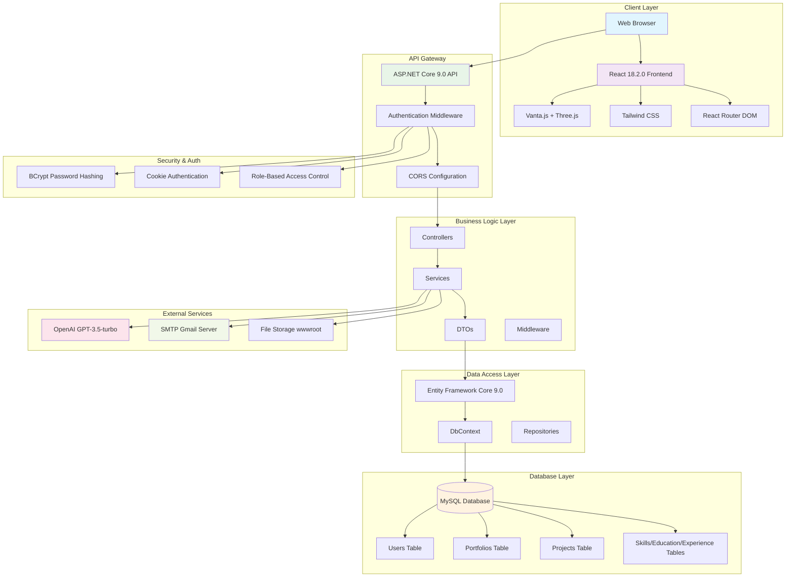
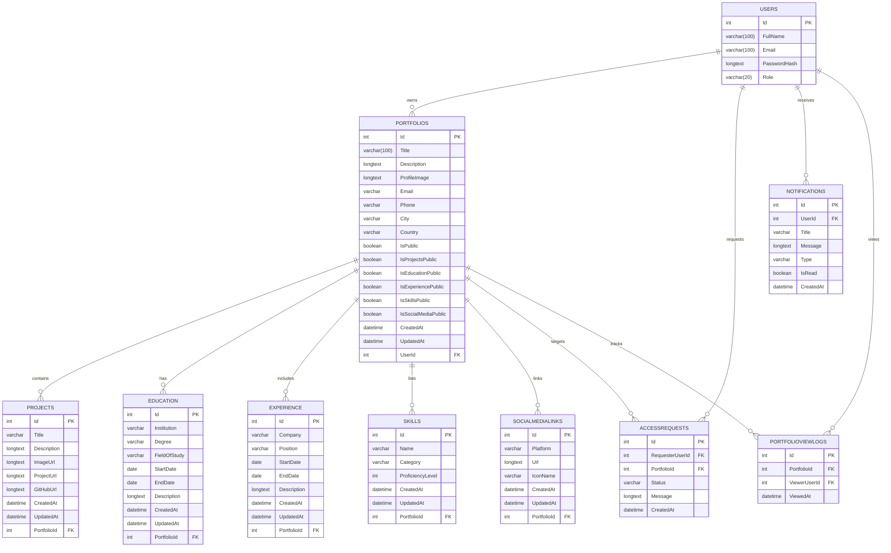
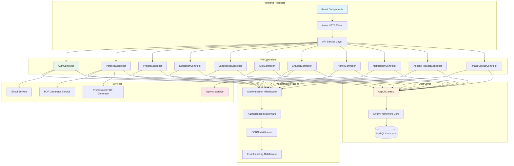
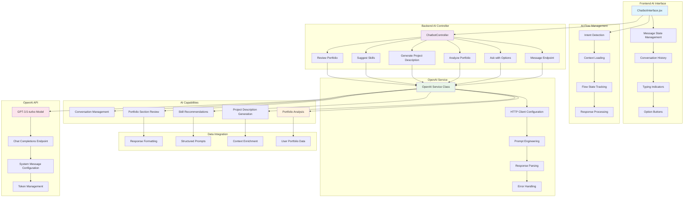
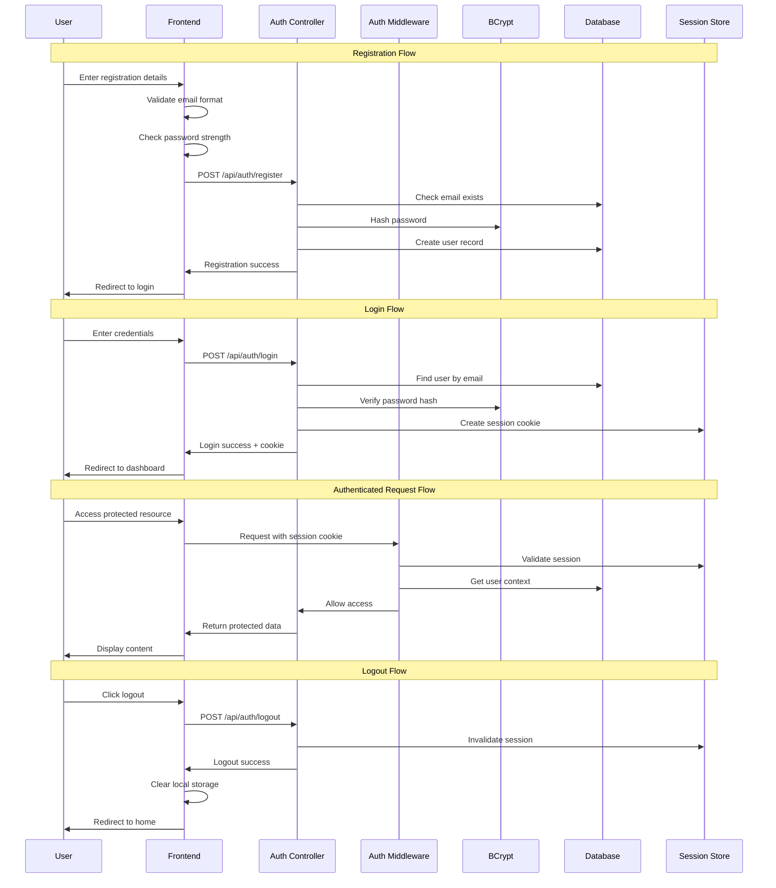
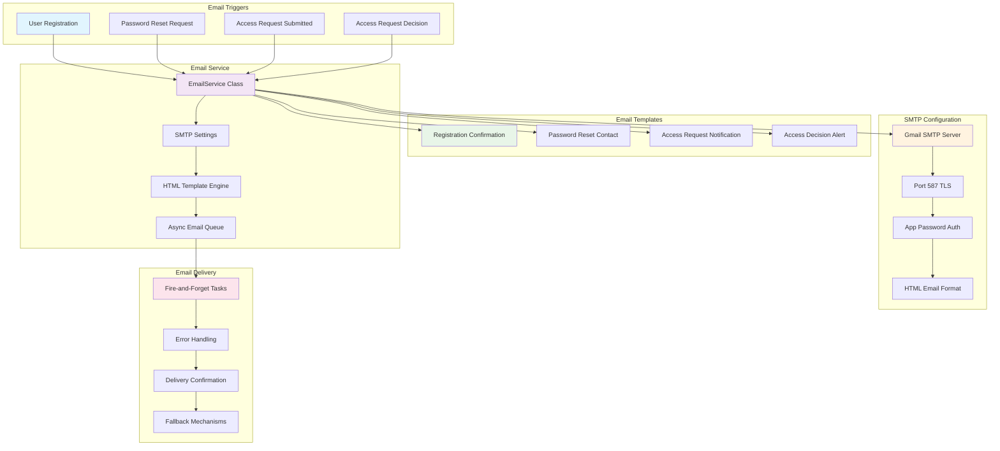
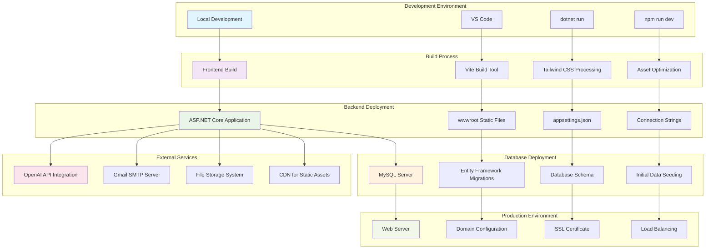

```mermaid
graph TB
    subgraph "Entry Point"
        A[index.html]
        B[main.jsx]
        C[App.jsx]
    end
    
    subgraph "Routing System"
        D[React Router DOM]
        E[Private Routes]
        F[Public Routes]
    end
    
    subgraph "Pages"
        G[Login.jsx]
        H[Register.jsx]
        I[Dashboard.jsx]
        J[PortfolioManager.jsx]
        K[PortfolioCreate.jsx]
        L[Profile.jsx]
        M[ChatbotInterface.jsx]
        N[AdminDashboard.jsx]
        O[NotificationCenter.jsx]
    end
    
    subgraph "Shared Components"
        Q[Navigation.jsx]
        R[PortfolioCard.jsx]
        S[ProjectCard.jsx]
        T[LoadingSpinner.jsx]
        U[Modal.jsx]
    end
    
    subgraph "Context & State"
        V[AuthContext]
        W[React useState]
        X[React useEffect]
        Y[Local Storage]
    end
    
    subgraph "Styling System"
        Z[Tailwind CSS]
        AA[index.css]
        AB[Custom CSS Classes]
        AC[Responsive Design]
    end
    
    subgraph "3D & Animation"
        AD[Vanta.js]
        AE[Three.js r134]
        AF[CSS Animations]
        AG[Glass Morphism]
    end
    
    subgraph "External Libraries"
        AH[Axios]
        AI[html2pdf.js]
        AJ[React Hooks]
    end
    
    A --> B
    B --> C
    C --> D
    D --> E
    D --> F
    E --> G
    E --> H
    F --> I
    F --> J
    F --> K
    F --> L
    F --> M
    F --> N
    F --> O
    F --> P
    
    G --> Q
    H --> Q
    I --> Q
    J --> Q
    K --> Q
    L --> Q
    M --> Q
    N --> Q
    O --> Q
    P --> Q
    
    I --> R
    J --> S
    G --> T
    H --> U
    
    C --> V
    G --> W
    H --> X
    I --> Y
    
    G --> Z
    H --> AA
    I --> AB
    J --> AC
    
    I --> AD
    J --> AE
    K --> AF
    L --> AG
    
    G --> AH
    H --> AI
    I --> AJ
    
    style A fill:#e1f5fe
    style G fill:#f3e5f5
    style Q fill:#e8f5e8
    style V fill:#fff3e0
    style Z fill:#fce4ec
    style AD fill:#f1f8e9
```

# 🏗️ Digital Portfolio - Complete Architecture Diagrams

## 📋 Table of Contents
1. [System Architecture Overview](#system-architecture-overview)
2. [Database Entity Relationship Diagram](#database-entity-relationship-diagram)
3. [API Architecture Diagram](#api-architecture-diagram)
4. [Frontend Architecture Diagram](#frontend-architecture-diagram)
5. [AI Assistant Architecture](#ai-assistant-architecture)
6. [Authentication & Security Flow](#authentication--security-flow)
7. [Email System Architecture](#email-system-architecture)
8. [Data Flow Diagrams](#data-flow-diagrams)
9. [Deployment Architecture](#deployment-architecture)

---

## 🎯 System Architecture Overview

---

## 🗄️ Database Entity Relationship Diagram

---

## 🔌 API Architecture Diagram

---

## 🎨 Frontend Architecture Diagram

---

## 🤖 AI Assistant Architecture

---

## 🔐 Authentication & Security Flow

---

## 📧 Email System Architecture

---

## 📊 Data Flow Diagrams

### Portfolio Creation Data Flow

```mermaid
graph LR
    A[User Input] --> B[Frontend Validation]
    B --> C[Form Data Collection]
    C --> D[API Request]
    D --> E[Authentication Check]
    E --> F[Controller Processing]
    F --> G[Entity Creation]
    G --> H[Database Transaction]
    H --> I[Response Generation]
    I --> J[Frontend Update]
    J --> K[UI Refresh]
    
    style A fill:#e1f5fe
    style D fill:#f3e5f5
    style F fill:#e8f5e8
    style H fill:#fff3e0
    style J fill:#fce4ec
```

### AI Assistant Data Flow

```mermaid
graph LR
    A[User Message] --> B[Intent Detection]
    B --> C[Context Loading]
    C --> D[Prompt Generation]
    D --> E[OpenAI API Call]
    E --> F[Response Processing]
    F --> G[Option Generation]
    G --> H[Frontend Display]
    H --> I[User Interaction]
    
    style A fill:#e1f5fe
    style B fill:#f3e5f5
    style D fill:#e8f5e8
    style E fill:#fff3e0
    style H fill:#fce4ec
```

---

## 🚀 Deployment Architecture

---

## 📋 Architecture Summary

### 🏗️ Key Architectural Patterns
- **MVC Pattern**: Controllers handle HTTP requests, Models represent data, Views handled by React
- **Repository Pattern**: Data access abstracted through Entity Framework
- **Service Layer Pattern**: Business logic separated into dedicated services
- **Middleware Pipeline**: Cross-cutting concerns handled via middleware
- **Component-Based Architecture**: Reusable React components
- **State Management**: React hooks and context for state management

### 🔧 Technology Integration Points
- **Frontend ↔ Backend**: REST API with JSON communication via Axios
- **Backend ↔ Database**: Entity Framework Core ORM with MySQL
- **Backend ↔ AI**: HTTP client integration with OpenAI API
- **Backend ↔ Email**: SMTP client for email notifications
- **Frontend ↔ 3D Graphics**: Vanta.js and Three.js for visual effects

### 🛡️ Security Architecture
- **Authentication**: Cookie-based sessions with BCrypt password hashing
- **Authorization**: Role-based access control (User/Admin)
- **Data Protection**: HTTPS enforcement, secure cookies, CORS configuration
- **Input Validation**: Frontend and backend validation layers
- **Error Handling**: Comprehensive error handling and logging

### 📈 Scalability Considerations
- **Database Indexing**: Proper foreign key relationships and indexes
- **Async Operations**: Fire-and-forget email sending, async API calls
- **Caching Strategy**: Authentication cache to reduce database calls
- **Resource Management**: Proper disposal of database contexts and HTTP clients
- **Performance Optimization**: Lazy loading, pagination, optimized queries

This comprehensive architecture documentation provides a complete technical overview of your Digital Portfolio system, covering all layers from frontend user interface to backend data persistence and external service integrations.